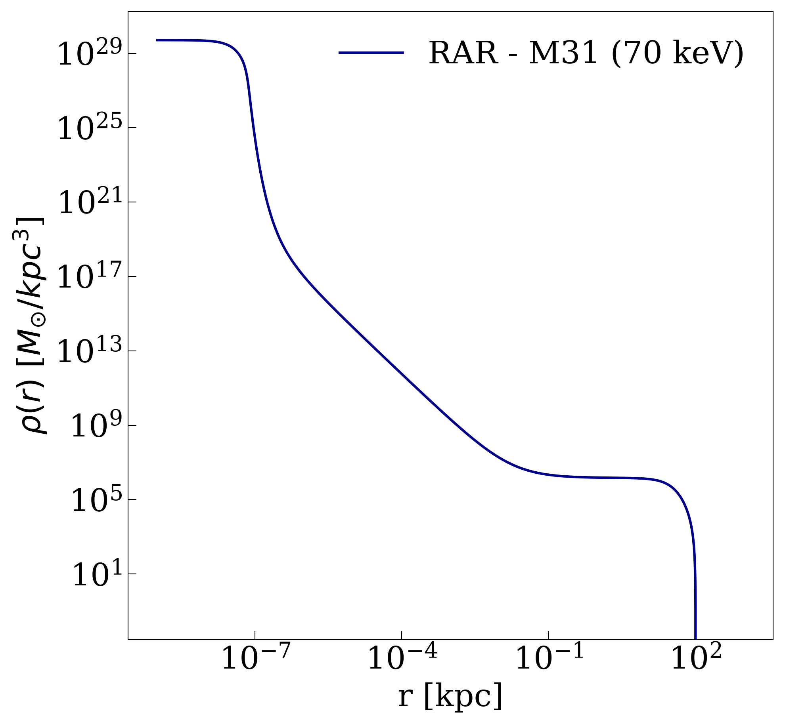
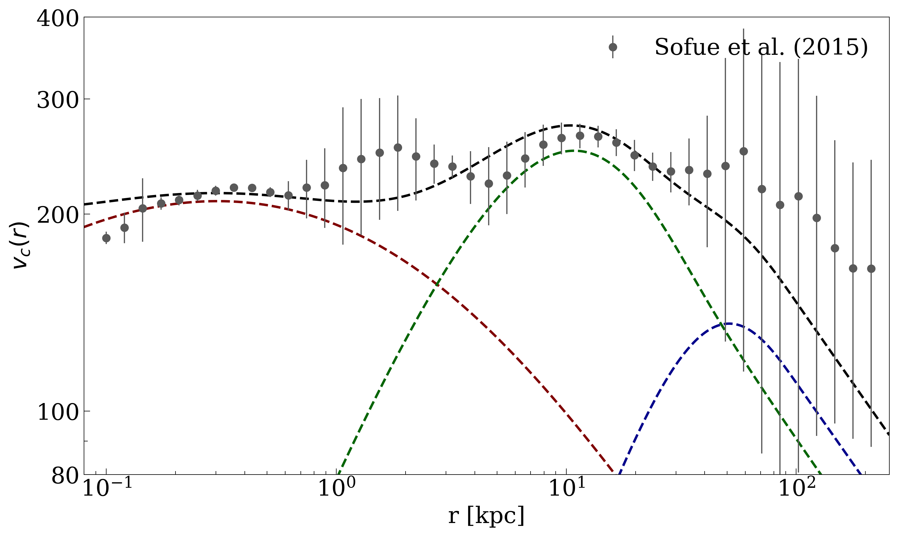

Example of use
==============

There are plenty of aplications where a RAR dark matter halo can play a role (see the main paper for further details). Here we show a classical application of galactic dynamics, the fitting of a rotation curve.

.. code-block:: python
    
    # =============================== Packages =================================== #
    import numpy as np
    from scipy.optimize import differential_evolution
    import os
    from fermihalos import Rar

    # Module containing two classes representing an arbitrary disk and an arbitrary bulge
    from mass_dist import ExponentialDisk, deVaucouleurs
    # ============================================================================ #

    # ============================= Observations ================================= #
    """ The observations were taken from Sofue, PASJ, 67, 4, 2015, 75 """
    # ---  radius (kpc), velocity (km/s), standard deviation (km/s)
    observations = np.loadtxt('M31_grand_rotation_curve.txt')
    radius = observations[:,0]
    velocities = observations[:,1]
    deviations = observations[:,2]

    # The first value of deviations is 0 on the list
    deviations[0] = deviations[0] + 4.0          # km/s

    # Maximum radii to work with
    r_gal_max = 250.0                            # kpc
    radius = radius[radius < r_gal_max]
    max_idx = len(radius)
    velocities = velocities[:max_idx]
    deviations = deviations[:max_idx]
    # ============================================================================ #

    # =========================== Initial parameters ============================= #
    # - RAR seed to do the fitting
    m_DM = 70.0                                  # keV

    # Degeneracy parameter
    theta_0 = 36.0

    # Cut-off parameter
    W_0 = 61.0

    # Temperature parameter
    beta_0 = 4.3e-3

    # Mass of the core and its error
    m_core = 1.0e8                               # M_Sun
    m_core_err = 0.1*m_core                      # M_Sun

    # - de Vaucouleurs bulge parameters - Best fits of Sofue 2015
    M_b = 1.7e10                                 # M_sun
    a_b = 1.35                                   # kpc
    kappa = 7.6695
    eta = 22.665

    # - Exponential disk parameters - Best fits of Sofue 2015
    M_d = 1.8e11                                 # M_sun
    a_d = 5.28                                   # kpc

    # Initial parameter vector
    p_0 = np.array([theta_0, W_0, beta_0, M_b, a_b, M_d, a_d])
    # ============================================================================ #

    # ========================= Bounds for parameters ============================ #
    """ Limits to constrain the parameter space and hence ease the best-fitting procedure """
    bounds = ((35.5, 37.5),
            (60.0, 62.0),
            (4.0e-3, 4.7e-3),
            (0.5*M_b, 1.5*M_b),
            (a_b - 0.5, a_b + 0.5),
            (1.6e11, 1.9e11),
            (4.6, 6.0))
    # ============================================================================ #

    # ====================== Reduced chi squared function ======================== #
    def chi_2_red(p):
        # Bulge object
        bulge = deVaucouleurs(np.array([p[3], p[4], kappa, eta]))

        # Disk object
        disk = ExponentialDisk(p[-2:])

        # Dark matter halo object
        halo = Rar(np.array([m_DM, p[0], p[1], p[2]]), circ_vel_func=True, core_func=True)

        # Total circular velocity
        v = np.sqrt(bulge.circular_velocity(radius)**2 + disk.circular_velocity(radius)**2 + 
                    halo.circular_velocity(radius)**2)

        # Reduced chi squared function
        chi = (np.sum((v - velocities)**2/deviations**2) + (halo.core()[1] - m_core)**2/m_core_err**2)/(len(velocities) - len(p))

        return chi
    # ============================================================================ #

    # ============================ Fitting function ============================== #
    def fit(cores):
        opt = differential_evolution(chi_2_red, bounds, strategy='best1bin', maxiter=150, 
                                    popsize=75, recombination=0.4, mutation=(0.2, 0.5),
                                    tol=1.0e-10, atol=0.0, disp=True, polish=True, 
                                    x0=p_0, seed=10, workers=cores)
        
        solution = opt.x
        np.savetxt('best_fit_parameters_for_M31_70kev.txt', solution)
        return solution
    # ============================================================================ #

    # =========================== Fitting procedure ============================== #
    # Number of CPU cores to run differential_evolution in parallel
    cores = 10
    best_fit_parameters = fit(cores)
    print("Fitting procedure completed\n")
    print("The best fit parameters are: ", best_fit_parameters)
    # ============================================================================ #

This code will generate a dark matter mass distribution with a radial profile as follows:

and a total circular velocity profile as:

